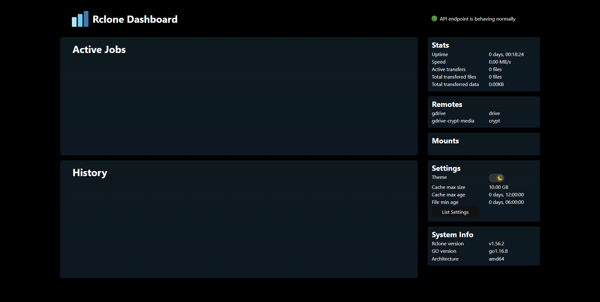
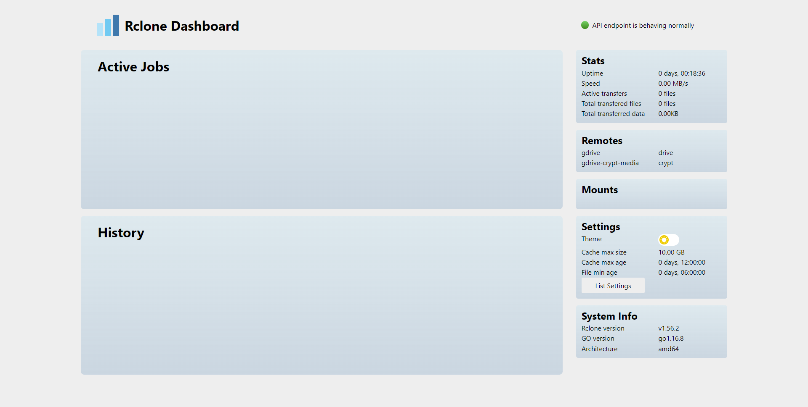
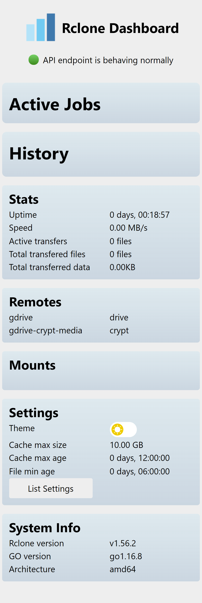
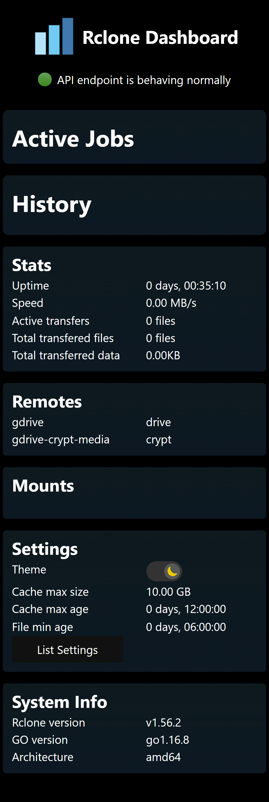

# Rclone WebUI

## Description
A simple information panel showing you all you need to know about your Rclone instance. 
### Features
- General stats from current rcd session
- View active running jobs and their transfers
- Browse the history of succesful transferred files
- View list of remotes
- View list of mounted remotes
- Darkmode (autodetect)
- View configured settings
- System info

#### What is Rclone
Rclone is a open source tool to transfer files from your local system to many types of cloud hosted storage. You can take a look at the project [here](https://rclone.org/)

#### Info about each Job
- Total job speed
- ETA for job and elapsed time
- Job total size and transferred size
- Speed for each file
- Size of each file
- ETA of each file

## Installation
Download package from [here]()

Place the contents in a folder and remember it's location, I like to use /webui because I will be running this in a docker container.

Start Rclone remote control server
```rclone rcd --rc-serve --rc-user <YOURUSER> --rc-pass <YOURPASS> /webui```
You can see the last argument is the folder where you placed the WebUI earlier. This is the same as specifying `--rc-files=/webui`. More documentation on rcd is available [here](https://rclone.org/rc).<br/>
If you are on a headless machine you can add the argument `--rc-web-gui-no-open-browser` so Rclone won't try to open a browser.

## Screenshots

### Darkmode


### Lightmode


### Mobile views



## Building from source

#### Prerequisites
To build the site you are expected to have npm and nodejs installed and have a active internet connection.

#### Build

Get the source files
```
git clone https://github.com/controlol/rclone-webui
cd rclone-webui
```

Install dependencies
`npm ci`

Build the project
`npm run build`

The WebUI should have been build in the build folder. Copy the files to a location you can easily access or use the build directory as the source for your rclone rcd.